# OCR Pipeline



A modular OCR pipeline using **DocLayout-YOLO**, **PaddleOCR**, and **Qwen3-VL** Vision LLM for intelligent document understanding.

---

## 🏗️ Architecture

Our solution implements a **three-stage "Segment-Refine-Structure" pipeline** using a hybrid architecture of fine-tuned models.

### Stage 1: Document Segmentation

It begins with a **fine-tuned DocLayout-YOLO** for section detection, followed by **Enhanced PaddleOCR** for word-level coordinates. By anchoring these coordinates to parent sections, we maintain a precise geometric link between raw pixels and semantics.

We employ a **"Mask & Discover" strategy**: previously detected sections are masked, and a page-level scan identifies "orphan" text, ensuring **100% data capture** via recursive IOU-based merging.

### Stage 2: Data Extraction

**PaddleOCR** detects granular text lines within each section. The multimodal **Qwen3-VL** engine then refines these results, correcting **multilingual text (Hindi, Sanskrit, English)** and reconstructing visual data—converting tables into **HTML** and mathematical notations into **LaTeX**—while preserving the document's logical flow and visual integrity.

These crops are processed by a fine-tuned **Qwen3-VL-8B-Instruct**, which performs "semantic section-level calls" to refine OCR and interpret complex artifacts like "cuttings." This integrated stage not only extracts text but also identifies deep entity relationships and generates intelligent summarizations at the source.

### Stage 3: Structured Output & Summarization

The system generates a **hierarchical JSON schema**—a digital twin mapping parent sections to child text boxes with normalized coordinates for spatial reconstruction. During this synthesis, the AI performs:

- **Entity Extraction**: Key-value pairs (IDs, dates, amounts)
- **Intelligent Summarization**: Concise descriptions for each section

This transforms unstructured, handwritten documents into a **structured, queryable knowledge base** containing both raw data integrity and high-level conceptual overviews.

---

## ✨ Features

- 🔍 **4-Stage Pipeline**: DocLayout-YOLO → PaddleOCR → Qwen3-VL → Summary
- 📄 **PDF Support**: Process multi-page PDFs with configurable DPI
- 🌐 **Multilingual**: Hindi, Sanskrit, English, and more
- 📊 **Entity Extraction**: Automatic key-value pair detection
- 🖼️ **Streamlit UI**: Interactive web interface for visualization

---

## 🚀 Quick Start (Streamlit App)

### 1. Install Dependencies

```bash
cd ocrrrrchalenge
pip install -r requirements.txt
```

### 2. Install System Dependencies

#### Poppler (for PDF support)
```bash
# Windows: Download from https://github.com/oschwartz10612/poppler-windows/releases
#          Extract and add bin/ folder to PATH

# Linux
sudo apt-get install poppler-utils

# Mac
brew install poppler
```

#### Hindi Fonts (for proper text rendering)
```bash
# Linux only - Windows/Mac have these pre-installed
sudo apt-get install fonts-noto fonts-noto-extra
```

### 3. Run Streamlit App

```bash
streamlit run streamlit_app.py
```

Open http://localhost:8501 in your browser.

### 4. Using the App

1. **Main Page**: Upload new images/PDFs and process them
2. **Sidebar**: Browse existing processed results
3. **Click on sections** in the image to view OCR text and entities

---

## 📦 Installation (Full Pipeline)

### Prerequisites

- Python 3.8+
- CUDA GPU (16GB+ VRAM recommended for Qwen3-VL)

### Step 1: Create Virtual Environment

```bash
python -m venv venv
source venv/bin/activate      # Linux/Mac
.\venv\Scripts\activate       # Windows
```

### Step 2: Install Python Packages

```bash
pip install -r requirements.txt
```

### Step 3: Download DocLayout-YOLO Model

1. Download `doclayout_yolo_docstructbench_imgsz1280_2501.pt`
2. Place in `models/` folder
3. Update path in `config.py` if needed

### Step 4: (Optional) Install Flash Attention

```bash
pip install flash-attn --no-build-isolation
```

---

## 💻 CLI Usage

```bash
# Process image
python main.py --input image.png --output ./output

# Process PDF
python main.py --input document.pdf --output ./output --dpi 300

# Process folder
python main.py --input ./images --output ./output

# CPU only mode
python main.py --input image.png --output ./output --no-gpu
```

---

## 📁 Project Structure

```
ocrrrrchalenge/
├── main.py                 # CLI entry point
├── streamlit_app.py        # Interactive web UI
├── pipeline.py             # OCRPipelineV2 class
├── config.py               # Configuration
├── requirements.txt
├── models/                 # DocLayout-YOLO model
├── stages/
│   ├── stage1_doclayout.py
│   ├── stage2_paddleocr.py
│   └── stage3_vision_llm.py
├── utils/
│   ├── visualization.py
│   ├── pdf_utils.py
│   └── coordinate_utils.py
└── data_models/
    └── schemas.py
```

---

## ⚙️ Configuration

Edit `config.py`:

```python
CONFIG = {
    "doclayout_model_path": "models/doclayout_yolo_docstructbench.pt",
    "doclayout_confidence": 0.2,
    "use_gpu": True,
    "enable_stage2": True,
    "batch_size": 5,
    "qwen_model_name": "Qwen/Qwen3-VL-8B-Instruct",
}
```

---


